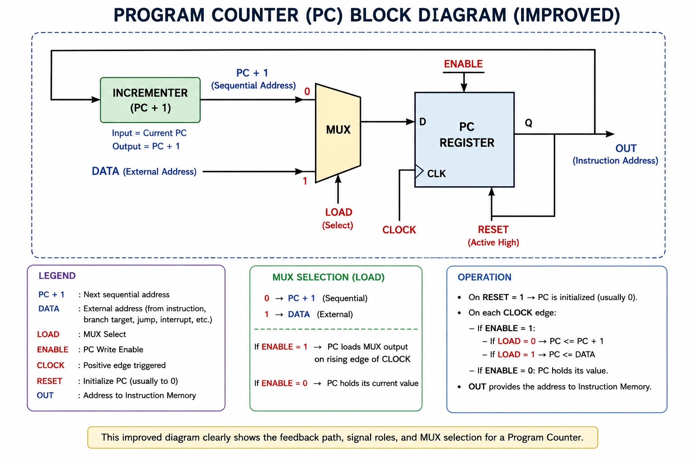

# Program Counter (PC) using Verilog HDL

## 1. Project Overview

A Program Counter (PC) is a fundamental sequential circuit used in a processor to store the address of the current instruction and determine the address of the next instruction.

In this project, a 4-bit Program Counter is designed and implemented using Verilog HDL.

The design supports:

- Reset
- Enable control
- Sequential PC increment
- Loading an external address
- Clocked operation

---

## 2. Functional Description

The Program Counter performs the following operations:

1. Reset the PC to `0`.
2. Increment the PC by `1` during normal operation.
3. Load an external address when `load = 1`.
4. Update the PC only when `en = 1`.
5. Hold the current PC value when `en = 0`.

The next value of the Program Counter is selected using a multiplexer between:

- `PC + 1`
- External `data`

---

## 3. Block Diagram

The following block diagram illustrates the internal architecture, control signals, feedback path, and data flow of the Program Counter.



### Block Diagram Explanation

The Program Counter consists of three main functional blocks:

**1. Incrementer**

The incrementer generates the next sequential address by adding `1` to the current PC value.

```text
PC + 1

---

## 4. Main Signals

| Signal | Direction | Width | Description |
|--------|-----------|-------|-------------|
| `clk` | Input | 1-bit | Positive-edge clock |
| `rst` | Input | 1-bit | Active-high reset |
| `en` | Input | 1-bit | Program Counter update enable |
| `load` | Input | 1-bit | MUX select signal |
| `data` | Input | 4-bit | External address/data |
| `q` | Output | 4-bit | Current Program Counter value |

---

## 5. Operation

### 5.1 Reset Operation

When:

```text
rst = 1
