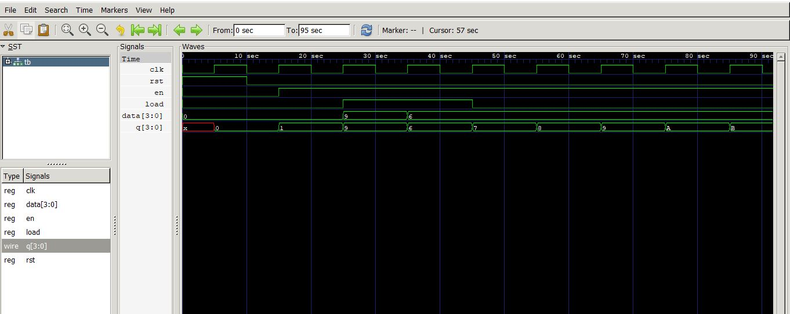

# Program Counter (PC)

## Overview

A Program Counter (PC) is a sequential digital circuit used in a processor to store the address of the next instruction to be executed.

## Function

The Program Counter:

- Stores the current instruction address.
- Increments to point to the next instruction.
- Can be loaded with a new address during jump/branch operations.
- Updates on the active clock edge.
- Can be reset to a known value.

## RTL Design

The Program Counter is implemented using Verilog HDL.

### Main Signals

| Signal | Direction | Description |
|--------|-----------|-------------|
| clk | Input | Clock signal |
| reset | Input | Reset signal |
| pc_next | Input | Next PC value |
| pc | Output | Current program counter value |

## Files

# Program Counter (PC)

## 1. Project Overview

A Program Counter (PC) is a sequential circuit used in a processor
to store the address of the next instruction to be executed.

The PC is updated on every active clock edge and can be reset to
a known initial address.

---

## 2. Functional Description

The Program Counter performs the following operations:

1. Reset the PC to a known value.
2. Increment the PC on every clock cycle.
3. Provide the current instruction address.
4. Support loading of a new address when required.

---

## 3. Block Diagram



---

## 4. RTL Design

The RTL implementation is available in:

`RTL/Program_Counter.v`

---

## 5. Testbench

The verification environment is available in:

`Testbench/Program_Counter_tb.v`

The testbench verifies:

- Reset operation
- Clock operation
- PC increment
- Output behavior

---

## 6. Simulation

Simulation results and waveform information are provided in:

`Simulation/`

---

## 7. Example Operation

```text
Reset
  |
  v
PC = 0
  |
  v
Clock
  |
  v
PC = PC + 1
  |
  v
Clock
  |
  v
PC = PC + 1- `Program_Counter.v` - RTL design
- `Program_Counter_tb.v` - Testbench
- `Program_Counter.JPG` - Block diagram
- `README.md` - Project documentation

## Simulation

Example using Icarus Verilog:

```bash
iverilog -o sim Program_Counter.v Program_Counter_tb.v
vvp sim
